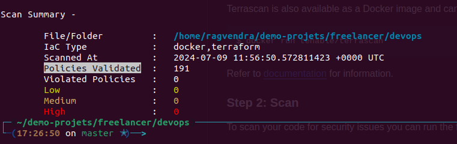
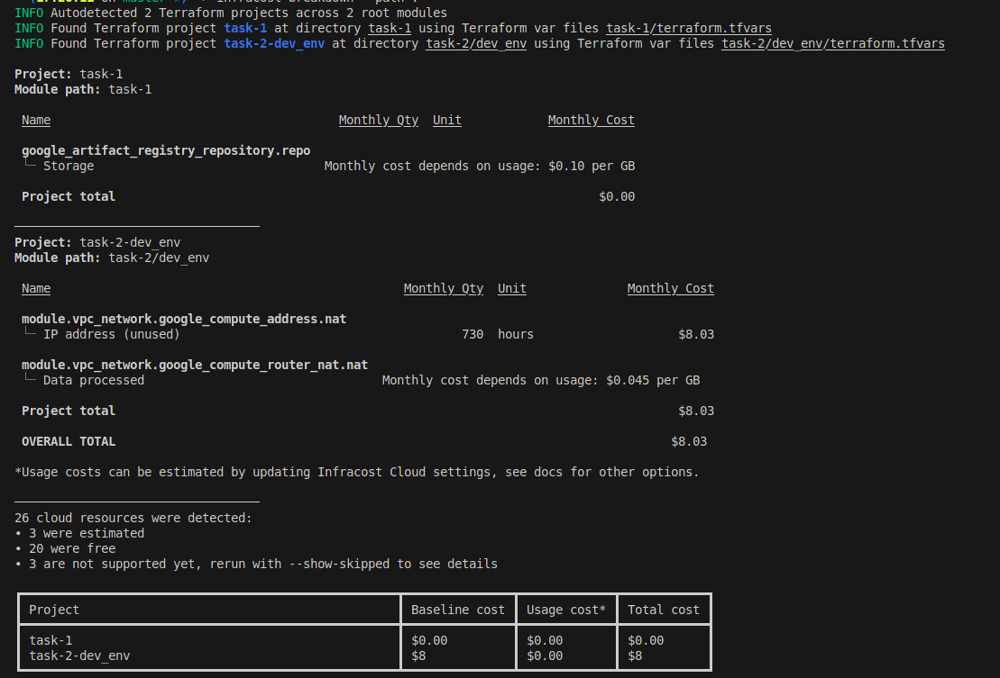

# GCP Cloud Run Service with Terraform

This project demonstrates how to create a Cloud Run service on Google Cloud Platform (GCP) using Terraform.

## Prerequisites

1. Install [Terraform](https://www.terraform.io/downloads.html)
2. Install [Google Cloud SDK](https://cloud.google.com/sdk/docs/install)
3. Set up a GCP account and create a billing account

## Setup
1. **Google Cloud Platform Account:** You need a GCP account with appropriate permissions to create and manage resources. Also, ensure that you have a JSON service account key file (`terraform-gcp-provider.json`) for authentication.
2. **Clone this repository:**
```bash
https://github.com/singhragvendra503/DevOps-Candidates-task.git
cd DevOps-Candidates-task
```

```tree                                                                                                                      
.
├── README.md
├── task-1
│   ├── Dockerfile
│   ├── terraform-gcp-provider.json
│   ├── index.html
│   ├── main.tf
│   ├── output.tf
│   ├── terraform.tfstate
│   ├── terraform.tfstate.backup
│   ├── terraform.tfvars
│   └── variable.tf
└── task-2
    ├── dev_env
    │   ├── terraform-gcp-provider.json
    │   ├── main.tf
    │   ├── output.tf
    │   ├── terraform.tfvars
    │   └── variable.tf
    ├── modules
    │   ├── cloud-run
    │   │   ├── 1-main.tf
    │   │   ├── 2-variable.tf
    │   │   └── 3-output.tf
    │   └── vpc
    │       ├── 1-vpc.tf
    │       ├── 2-subnets.tf
    │       ├── 3-router.tf
    │       ├── 4-nat.tf
    │       ├── 5-internet-gateway.tf
    │       ├── 6-firewalls.tf
    │       ├── 7-variable.tf
    │       └── 8-output.tf
    ├── prod_env
    │   ├── terraform-gcp-provider.json
    │   ├── main.tf
    │   ├── output.tf
    │   ├── terraform.tfvars
    │   └── variable.tf
    └── stg_env
        ├── terraform-gcp-provider.json
        ├── main.tf
        ├── output.tf
        ├── terraform.tfvars
        └── variable.tf
```
3. Create `terraform.tfvars` as you see in above file tree structure
```
###############################################################################################################
#                                               VPC_network varibales                                         #
###############################################################################################################

region = "us-east4"
project_id = "<project_name>"
ports = [ "22", "80", "443" ]
public_subnets_cidr_range = [
    "10.0.1.0/24",
    "10.0.2.0/24",
    "10.0.3.0/24",
  ]
private_subnets_cidr_range = [
    "10.0.4.0/24",
    "10.0.5.0/24",
    "10.0.6.0/24",
  ]
appname = "hello-world"
environment = "demo"


###############################################################################################################
#                                               Cloud Run varibales                                           #
###############################################################################################################

service_name = "hello-world"
container_image = "${REGION}-docker.pkg.dev/${PROJECT_ID}/aws-move/hello-world:latest"
container_port = 80
memory = "500Mi"
cpu = "2"
max_instances = 2
vpc_connector_name = "hello-connector"
vpc_connector_cidr_range = "10.8.0.0/28"
```
4. Create a simple `"Hello World"` Docker image:
```bash
docker build -f Dockerfile -t ${REGION}-docker.pkg.dev/${PROJECT_ID}/aws-move/hello-world:latest .
```
5. Authenticate GCR registry
```bash
cat terraform-gcp-provider.json | docker login -u _json_key --password-stdin ${REGION}-docker.pkg.dev/${PROJECT_ID}/aws-move
```
6. Build and push the Docker image to Artifact Registry:
```bash
docker push ${REGION}-docker.pkg.dev/${PROJECT_ID}/aws-move/hello-world:latest
```
Replace `${REGION}` and `${PROJECT_ID}` with your chosen region and project ID.

## Deployment

1. Initialize Terraform:
```bash
terraform init
```
2. Validate terraform code syntex 
```bash
terraform validate
```
3. Preview the changes:
```bash
terraform plan
```
4. Apply the changes:
```bash
terraform apply
```
5. After the deployment is complete, Terraform will output the URL of your Cloud Run service. You can access your "Hello World" application at this URL.

## Cleanup

To remove all resources created by Terraform:
```bash
terraform destroy
```
## Scan Policy Validation Using [terrascan](https://runterrascan.io/)

## Mothly Cost Calculated Using [infracost](https://www.infracost.io/)


Note: This will delete the GCP project and all associated resources.